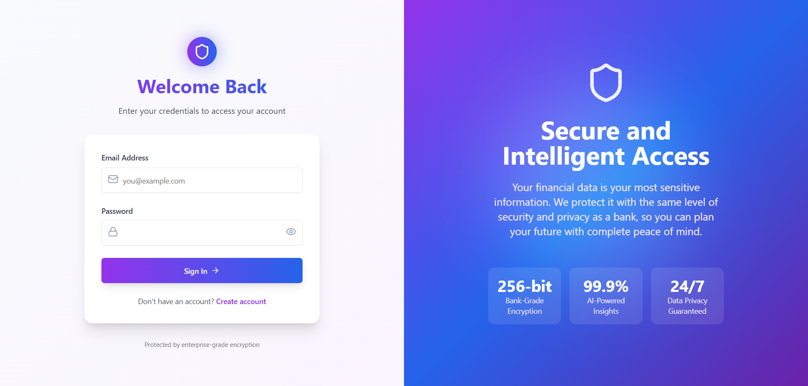
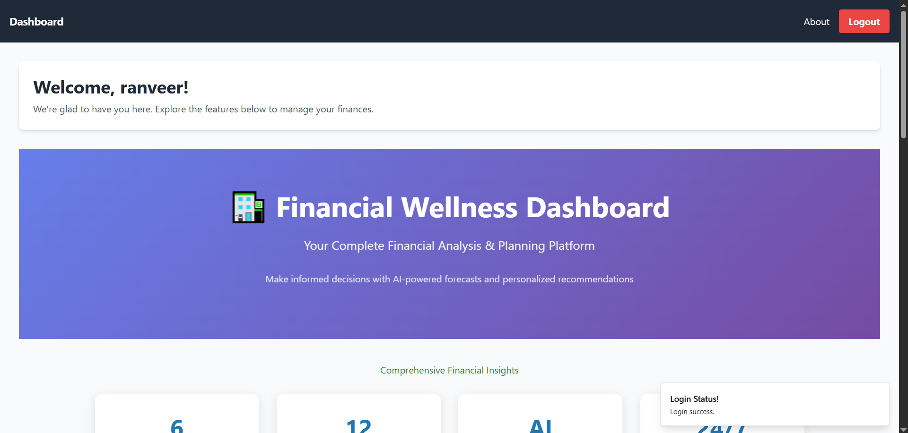
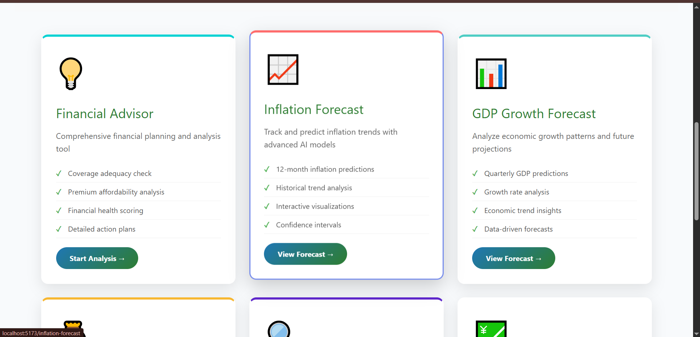
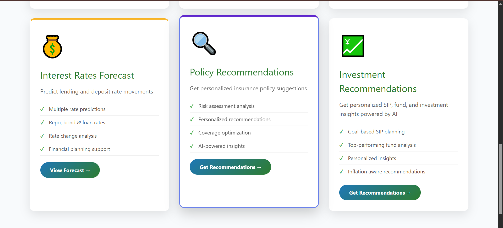
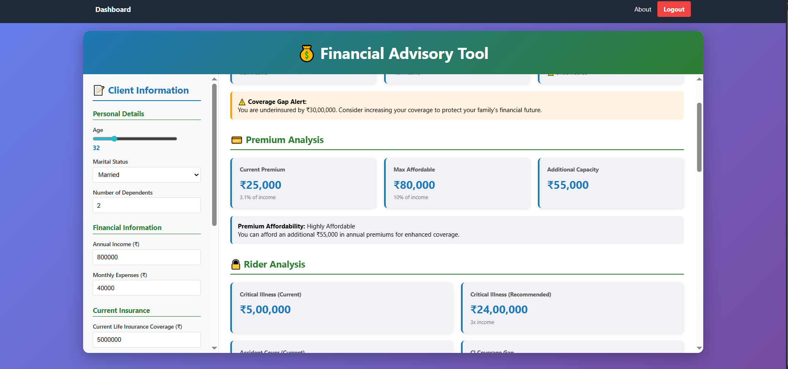
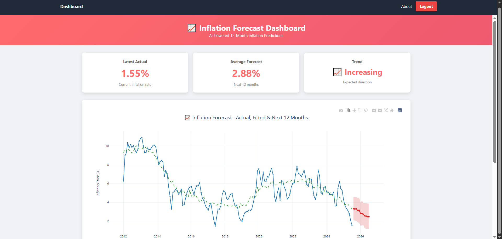
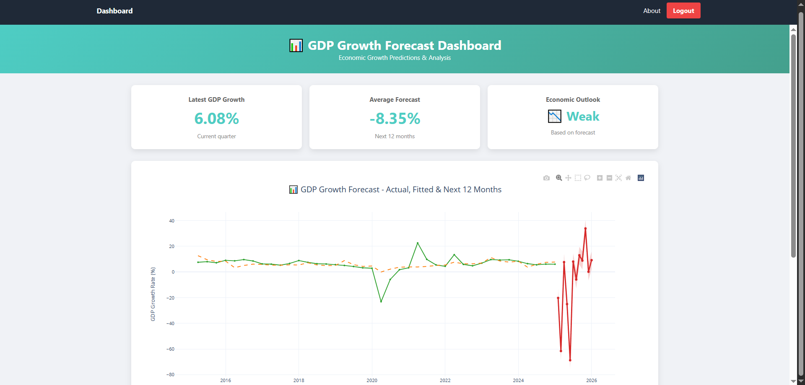
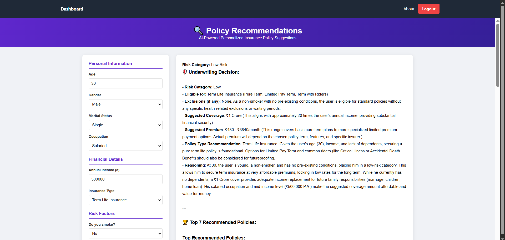
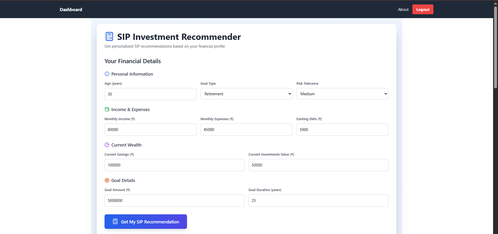

# FinScope: Forecasting Personalized Financial Wellness Platform using AI 📈

**FinScope** is an AI-powered financial wellness platform designed to bridge the gap between macroeconomic forecasting and personalized financial planning. It integrates economic trend analysis with tailored investment advice and insurance readiness assessments into a single, unified system.

---

## 📸 Screenshots & Demo

  
   
    
  
   
   
   
   
   

---

## 💡 Key Features

* **Macroeconomic Forecasting:** Utilizes the Facebook Prophet model to predict key economic variables such as inflation, GDP growth, and interest rates.
* **Goal-Based Investment Advisory:** Recommends Systematic Investment Plans (SIPs) and mutual funds based on individual risk profiles, financial goals, and time horizons.
* **Intelligent Insurance Analysis:** Analyzes current coverage to identify gaps, determine if a user is underinsured, and optimize premiums.
* **LLM-Driven Interpretation:** Employs a Large Language Model (LLM) to translate complex numerical forecasts into clear, human-understandable financial advice.
* **Local Data Security:** All processing is done locally to ensure user data remains secure and private without relying on external cloud services.

---

## 🛠️ System Architecture

FinScope uses a modular, multi-tier architecture designed for fault isolation and scalability.

### 1. Presentation Layer (Frontend)
* **Framework:** React.js 18.2
* **Styling:** Tailwind CSS
* **Data Visualization:** Interactive graphical summaries built with **Re-charts**.

### 2. Application Layer (Backend)
* **Framework:** Flask 2.3.2 running on Python 3.9.13
* **Role:** Acts as the API Gateway, routing requests and integrating with Data Science libraries.

### 3. Intelligence Layer (Models)
* **Forecasting Model:** **Facebook Prophet** handles seasonality, trends, and "changepoints" in economic data.
* **Optimization:** SIP recommendations are treated as a mathematical optimization problem using the Future Value of an Ordinary Annuity formula.
* **Transparency:** Includes an explainability layer to build user trust through transparent AI predictions.

---

## 📖 Methodology Highlights

* **Data Preprocessing:** Uses linear interpolation for missing value imputation and z-score standardization for normalization across different scales.
* **Seasonality Modeling:** Employs **Fourier Series** to decompose complex seasonal cycles (daily, weekly, yearly) into smooth periodic waves.
* **Goal-Based Investing (GBI):** Focuses on the "velocity of money" to achieve specific life objectives rather than just traditional market benchmarks.

---

